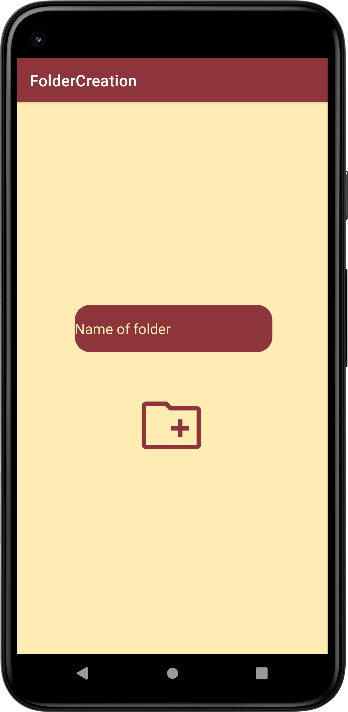
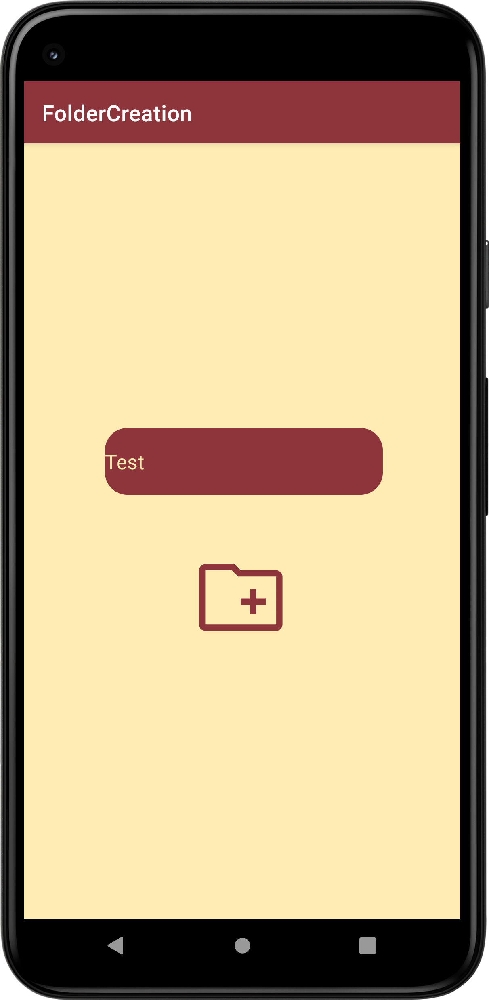

# AndroidFolderCreation
## Screen preview
<p float="left">


</p>

## Android version permissions
Add in your AndroidManifest:

Permissions for the Android below 11 (R)
```
<uses-permission android:name="android.permission.READ_EXTERNAL_STORAGE"/>
<uses-permission android:name="android.permission.WRITE_EXTERNAL_STORAGE"/>
```
Permission for the Android 11 (R) and above
```
<uses-permission android:name="android.permission.MANAGE_EXTERNAL_STORAGE"/>
```
Android 10 only requires
```
android:requestLegacyExternalStorage="true"
```
